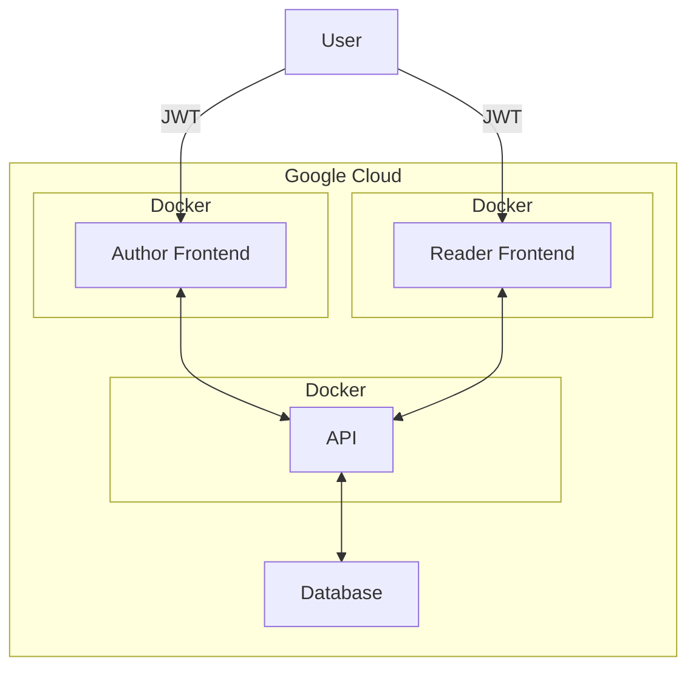

# Easy Blog

A play on the name Medium, this project is ran on 3 different servers in order to test out cors and to serve an API to multiple frontends.

## Servers

1. api
2. reader-frontend
3. author-frontend

## Challenges

Given that a lot of the code is replicated across both frontends, a way to group certain components, pages, and utils would be helpful if this project was redone. Overall maybe this project would've been better off as one frontend rather than split as two.

Another challenge was the feature of having anonymous users. This complicated many of the APIs that required authentication, as well as the authentication middleware.

## Architecture

